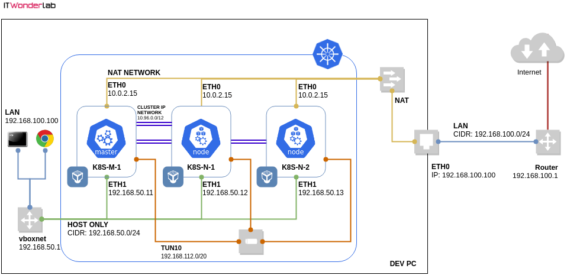

## Prerequisites

- Kubectl: client (1.17), server (1.17)
- Helm: 2.16.1
- Vagrant: 2.2.7
- VirtualBox: 6.1
- Ansible: 2.5.1
- sshpass: 1.06 (apt install)

## Helm: Install the version 2 (not 3)

```sh
# Helm 2
$ curl -L https://git.io/get_helm.sh | bash
```

Or, use the script __get_helm2.sh__ in __./utils/helm/__

## Kubernetes: Network Overview



## Vagrant: Create master and nodes

```sh
# Create the configuration directory
$ mkdir -p ~/.kube
# Mount the VMs
$ vagrant up
# Find the SSH port of the k8s-m-1 server
$ vagrant port k8s-m-1
# Copy the file using scp (ssh password is vagrant)
$ sshpass -p 'vagrant' scp -P 2222 vagrant@127.0.0.1:/home/vagrant/.kube/config ~/.kube/config
```

## Kubernetes: Installing Tiller

```sh
$ kubectl create serviceaccount --namespace kube-system tiller
$ kubectl create clusterrolebinding tiller-cluster-rule --clusterrole=cluster-admin --serviceaccount=kube-system:tiller
$ kubectl patch deploy --namespace kube-system tiller-deploy -p '{"spec":{"template":{"spec":{"serviceAccount":"tiller"}}}}'
$ helm init --service-account tiller --upgrade
```

## Kubernetes: SSL certificates

https://kubernetes.io/docs/concepts/cluster-administration/certificates/

> Important: MASTER_IP=192.168.50.11
> Important: MASTER_CLUSTER_IP=10.96.0.1

## Helm: Install "Kubernetes Dashboard"

https://kubernetes.io/docs/tasks/access-application-cluster/web-ui-dashboard/

```sh
$ helm install kubernetes/kubernetes-dashboard --name kubernetes-dashboard --values kubernetes/values-kubernetes-dashboard.yaml
```

## Kubernetes Nginx Ingress

http://dockerlabs.collabnix.com/kubernetes/beginners/Installing-Nginx-Ingress-controller.html

```sh
$ helm install kubernetes/nginx-ingress --name nginx-ingress --values kubernetes/values-nginx-ingress.yaml
```

## Copyrights

* https://www.itwonderlab.com/ansible-kubernetes-vagrant-tutorial
* https://github.com/ITWonderLab/ansible-vbox-vagrant-kubernetes
